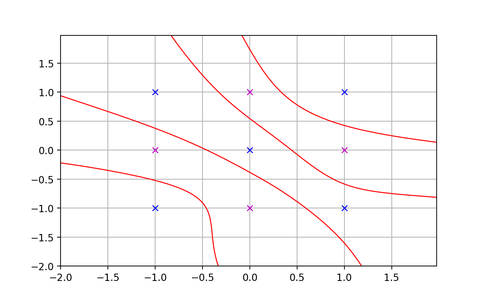

# Neurons learning chessboard

## Single-neuron classifier for affine separation

## Single-neuron classifier for quadratic separation

## Multilayer perceptron with 1 hidden layer of 10 neurons

## Multilayer perceptron with 1 hidden layer of 20 neurons

## Multilayer perceptron with 1 hidden layer of 50 neurons

## Multilayer perceptron with 2 hidden layers of 10 neurons

## Multilayer perceptron with 2 hidden layers of 20 neurons

## Multilayer perceptron with 2 hidden layers of 50 neurons

## Multilayer perceptron with 3 hidden layers of 10 neurons

## Multilayer perceptron with 4 hidden layers of 10 neurons

